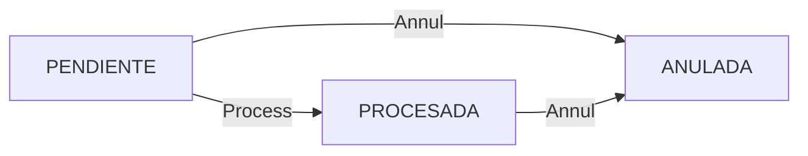

# Land Accounting

The Land Accounting module tracks land use changes at **Level 4** and calculates their patrimonial (financial) impact. This system ensures accurate accounting when land use changes occur, such as converting forest land to agricultural use.

## Overview

Land accounting provides:
- **Land use change tracking** - Monitor when Level 4 units change from one use to another
- **Patrimonial variation calculation** - Calculate financial impact of land use changes
- **Area reconciliation** - Ensure total areas match across hierarchy levels
- **Status workflow** - Process or annul variations with full audit trail

## Land Patrimonial Variations

When a Level 4 stand changes land use, a **Land Patrimonial Variation** record is created:

```typescript
type LandPatrimonialVariation = {
  id: string;
  organizationId: string;
  level4Id: string;                      // Affected Level 4 stand
  
  // Land Use Change
  previousLandUseName?: string;          // Previous use (or null for new)
  newLandUseName: string;                // New land use
  affectedAreaHa: number;                // Area affected (hectares)
  
  // Financial Impact
  referenceValueBeforeUsd: number;       // Reference value before change
  referenceValueAfterUsd: number;        // Reference value after change
  totalValueBeforeUsd: number;           // Total value before
  totalValueAfterUsd: number;            // Total value after
  patrimonialDeltaUsd: number;           // Net change in value
  
  // Classification
  kind: PatrimonialVariationKind;
  status: PatrimonialVariationStatus;
  
  // Metadata
  variationDate: Date;                   // When the change occurred
  notes?: string;                        // Additional notes
  processedAt?: Date;                    // When it was processed
  
  // Relationships
  createdById: string;                   // Who created it
  processedById?: string;                // Who processed it
};
```

## Variation Types

Variations are classified by their financial impact:

```typescript
enum PatrimonialVariationKind {
  INCREMENTO   // Increase in patrimonial value
  DECREMENTO   // Decrease in patrimonial value
  SIN_CAMBIO   // No change in value
}
```

## Variation Status Workflow

Variations follow a three-state workflow:

```typescript
enum PatrimonialVariationStatus {
  PENDIENTE  // Pending - awaiting processing
  PROCESADA  // Processed - change applied
  ANULADA    // Annulled - cancelled and reverted
}
```

### Status Transitions



<Accordion title="Processing a Variation">
  When a variation is **processed**:
  1. The Level 4's `currentLandUseName` is updated to the new land use
  2. The variation status changes to `PROCESADA`
  3. The `processedAt` timestamp and `processedById` are recorded
  4. Land use area summaries are recalculated

  **Endpoint:** `PATCH /api/forest/land-accounting/variations/{id}`
  
  **Request:**
  ```json
  {
    "action": "PROCESS"
  }
  ```
</Accordion>

<Accordion title="Annulling a Variation">
  When a variation is **annulled**:
  1. The Level 4 stand is marked as `isActive: false`
  2. The variation status changes to `ANULADA`
  3. Land use area summaries are recalculated (excluding the annulled stand)
  4. The change is logged in the audit trail

  **Use case:** When a land use change was recorded in error or needs to be reversed.

  **Endpoint:** `PATCH /api/forest/land-accounting/variations/{id}`
  
  **Request:**
  ```json
  {
    "action": "ANNUL"
  }
  ```
</Accordion>

## Land Use Types

Land uses are defined in the `LandUseType` catalog:

```typescript
type LandUseType = {
  id: string;
  continentId?: string;              // Optional continent scope
  code: string;
  name: string;                      // e.g., "Forest Plantation", "Natural Forest"
  category: string;                  // Broad category
  surfaceHa: number;                 // Total surface for this use
  isProductive: boolean;             // Whether it's productive land
  isActive: boolean;
};
```

**Example Land Use Types:**
- Forest Plantation (Commercial)
- Natural Forest (Conservation)
- Agricultural Land
- Pasture
- Infrastructure
- Water Bodies
- Protected Areas

## Area Calculations

### Hierarchy Area Reconciliation

The system maintains area consistency across levels:

```
Level 2: totalAreaHa
  └─ Sum of Level 3: totalAreaHa
      └─ Sum of Level 4: totalAreaHa
```

<Note>
**Geometry-based calculations:** When GIS data is available, areas are recalculated from polygon geometries using PostGIS spatial functions.
</Note>

## Geometry Integration

Level 4 units can have associated geometries:

```typescript
type ForestGeometryN4 = {
  id: string;
  organizationId: string;
  level2Id: string;
  level3Id: string;
  level4Id: string;
  geom: MultiPolygon;                // PostGIS geometry
  centroid: Point;                   // Geographic center
  superficieHa: number;              // Calculated area from geometry
  validFrom: Date;                   // Temporal validity
  validTo?: Date;
  isActive: boolean;
  importJobId?: string;              // Reference to import job
};
```

### Geometry Recalculation Jobs

When geometries change, recalculation jobs update area values:

```typescript
type ForestGeometryRecalcJob = {
  id: string;
  organizationId: string;
  level4Id: string;
  status: GeoRecalcJobStatus;        // PENDING, PROCESSING, COMPLETED, FAILED
  attempts: number;
  runAfter: Date;                    // Schedule for background processing
  lastError?: string;
  startedAt?: Date;
  completedAt?: Date;
};
```

## Geo Variation Operations

Complex geometric operations (split/merge) trigger land variations:

```typescript
type GeoLandVariationJob = {
  id: string;
  organizationId: string;
  status: GeoVariationJobStatus;
  operationType: GeoVariationOperationType;  // SPLIT or MERGE
  variationDate: Date;
  notes?: string;
  payload: any;                               // Operation-specific data
  attempts: number;
  runAfter: Date;
  startedAt?: Date;
  completedAt?: Date;
  lastError?: string;
};

enum GeoVariationOperationType {
  SPLIT   // Split one Level 4 into multiple units
  MERGE   // Merge multiple Level 4 units into one
}
```

<Accordion title="Split Operation">
  **Split** divides a Level 4 stand into multiple new stands:
  1. Original stand is deactivated
  2. New stands are created with proportional areas
  3. Land patrimonial variations are generated for each new stand
  4. Geometries are subdivided

  **Use case:** Subdividing a large stand for different management regimes.
</Accordion>

<Accordion title="Merge Operation">
  **Merge** combines multiple Level 4 stands into one:
  1. Original stands are deactivated
  2. New merged stand is created
  3. Total area equals sum of merged stands
  4. Geometries are unioned
  5. Land patrimonial variation is generated

  **Use case:** Consolidating adjacent stands under uniform management.
</Accordion>

## API Endpoints

<Accordion title="GET /api/forest/land-accounting/variations">
  Fetch land patrimonial variations (only shows modified land uses).

  **Query Parameters:**
  - `page`: Page number (default: 1)
  - `limit`: Results per page (default: 25)
  - `status`: Filter by status (`PENDIENTE`, `PROCESADA`, `ANULADA`)
  - `level4Id`: Filter by specific Level 4 unit
  - `search`: Search in land use names, Level 4 code/name
  - `fromDate`: Filter by variation date (start)
  - `toDate`: Filter by variation date (end)

  **Response:**
  ```json
  {
    "success": true,
    "data": {
      "items": [
        {
          "id": "uuid",
          "previousLandUseName": "Natural Forest",
          "newLandUseName": "Forest Plantation",
          "affectedAreaHa": 15.50,
          "patrimonialDeltaUsd": 45000.00,
          "status": "PENDIENTE",
          "variationDate": "2024-03-15",
          "level4": {
            "id": "uuid",
            "code": "R001",
            "name": "Rodal Pino 1"
          }
        }
      ],
      "pagination": { ... }
    }
  }
  ```

  <Note>
  The API automatically filters out records where `previousLandUseName` equals `newLandUseName` (no actual change).
  </Note>
</Accordion>

<Accordion title="PATCH /api/forest/land-accounting/variations/{id}">
  Process or annul a land patrimonial variation.

  **Request Body:**
  ```json
  {
    "action": "PROCESS"  // or "ANNUL"
  }
  ```

  **Actions:**
  - `"PROCESS"`: Apply the land use change to the Level 4 unit
  - `"ANNUL"`: Cancel the variation and inactivate the Level 4 unit

  **Response:**
  ```json
  {
    "success": true,
    "data": {
      "id": "uuid",
      "status": "PROCESADA",
      "processedAt": "2024-03-15T10:30:00Z",
      "processedById": "user-uuid"
    }
  }
  ```
</Accordion>

<Accordion title="POST /api/forest/geo/operations">
  Trigger geometric split or merge operations.

  **Request Body (Split):**
  ```json
  {
    "operationType": "SPLIT",
    "level4Id": "uuid",
    "splitRatios": [0.6, 0.4],
    "variationDate": "2024-03-15",
    "notes": "Splitting for silvicultural treatment"
  }
  ```

  **Request Body (Merge):**
  ```json
  {
    "operationType": "MERGE",
    "level4Ids": ["uuid1", "uuid2", "uuid3"],
    "variationDate": "2024-03-15",
    "notes": "Merging adjacent stands"
  }
  ```
</Accordion>

## Code Example

```typescript
// Fetch pending land variations
const response = await fetch(
  '/api/forest/land-accounting/variations?status=PENDIENTE&page=1&limit=50'
);
const result = await response.json();
const pendingVariations = result.data.items;

// Process a variation
const processResponse = await fetch(
  `/api/forest/land-accounting/variations/${variationId}`,
  {
    method: 'PATCH',
    headers: { 'Content-Type': 'application/json' },
    body: JSON.stringify({ action: 'PROCESS' })
  }
);

if (processResponse.ok) {
  console.log('Land use change applied successfully');
  // The Level 4's currentLandUseName has been updated
  // Area summaries have been recalculated
}

// Annul a variation (reverses the change)
const annulResponse = await fetch(
  `/api/forest/land-accounting/variations/${variationId}`,
  {
    method: 'PATCH',
    headers: { 'Content-Type': 'application/json' },
    body: JSON.stringify({ action: 'ANNUL' })
  }
);

if (annulResponse.ok) {
  console.log('Variation annulled, Level 4 inactivated');
}
```

<Note>
**Important:** Only variations with modified land use (where `previousLandUseName` ≠ `newLandUseName`) are shown in the API responses. This filters out initial establishment records.
</Note>

## Best Practices

1. **Review before processing** - Always verify land use changes before processing variations
2. **Use annul carefully** - Annulling a variation inactivates the Level 4 stand permanently
3. **Document changes** - Add notes to variations explaining the reason for land use changes
4. **Monitor geometry jobs** - Check that geometry recalculation jobs complete successfully
5. **Regular reconciliation** - Periodically verify that hierarchy area totals match
